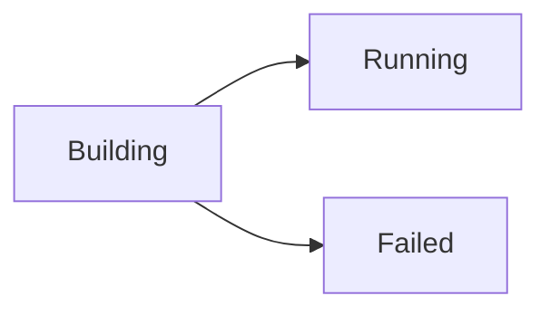

Better-PaaS is installed and running. Let's put an app online.

## Step 1 — Sign in

Open the dashboard in your browser:

- Local install: `http://localhost:3000`
- Remote server: `http://YOUR_SERVER_IP:3000`

You'll see a sign-in screen asking for your **admin token**. Paste the token the
installer gave you and continue.

<Callout title="Where's my token again?">
  Run this on your server to print it:

  ```bash
  cd ~/better-paas/backend && ./server token
  ```
</Callout>

## Step 2 — Start a new deploy

From the main dashboard, click **Deploy a service**. You'll be asked for a few
things:

| Field | What to enter |
| ----- | ------------- |
| **Git repository** | The URL of your repo, e.g. `https://github.com/you/my-app`. |
| **Branch** | The branch to deploy, usually `main`. |
| **Name** | A friendly name for the app (optional — one is suggested). |

### Deploying a private repository

If your repo is private, Better-PaaS needs permission to clone it. Add a **Git
access token** (a personal access token from GitHub/GitLab) when prompted, or
save one ahead of time under **Settings → Git**. Tokens are
[encrypted at rest](/docs/security#encryption-at-rest).

## Step 3 — Watch it build

Click **Deploy**. The app status moves through a few stages:



- **Building** — Nixpacks is detecting your stack and compiling your code. Build
  logs stream live; watch them to spot any errors.
- **Running** — success! Your container is up and serving traffic.
- **Failed** — something went wrong during the build. Read the logs to see what,
  fix it, and redeploy.

<Callout type="info" title="What is Nixpacks doing?">
  Nixpacks looks at your project files — `package.json`, `requirements.txt`,
  `go.mod`, and so on — to automatically detect the language and build commands.
  For most common stacks you don't need a Dockerfile at all.
</Callout>

## Step 4 — Open your live app

Once the status is **Running**, the app gets an automatic URL:

```text
http://<app-id>.<your-server-ip>.sslip.io
```

Click it in the dashboard to open your app in a new tab. That's a real,
internet-reachable URL — no DNS configuration required to get going.

## Step 5 — Make a change and redeploy

Change some code, push it, and redeploy to see the loop in action:

- Click **Redeploy** on the app to rebuild from the latest commit, **or**
- Set up [auto-deploy on git push](/docs/guides/auto-deploy) so every push
  redeploys automatically.

New deploys are **zero-downtime**: the new version is built and health-checked on
a fresh port *before* traffic switches over, and the old container is only
retired once the new one is healthy.

## Common first-deploy questions

<Accordions>
<Accordion title="My build failed. What do I do?">
Open the app and read the build logs — they almost always say what went wrong
(a missing dependency, a failing build command, etc.). Fix it in your repo and
click **Redeploy**. See [Troubleshooting](/docs/troubleshooting) for common
cases.
</Accordion>

<Accordion title="My app builds but won't start.">
Make sure your app listens on the port Better-PaaS expects. Most frameworks read
a `PORT` environment variable — bind to that rather than a hard-coded port.
</Accordion>

<Accordion title="Can I deploy more than one app?">
Yes. Deploy as many as your server has resources for. Each gets its own
container, URL, logs, and settings.
</Accordion>
</Accordions>

## Next step

<Cards>
  <Card
    title="Tour the dashboard"
    href="/docs/getting-started/the-dashboard"
    description="Learn what every screen does."
  />
  <Card
    title="Core guides"
    href="/docs/guides/deploying-an-app"
    description="Domains, databases, cron jobs, backups, and more."
  />
</Cards>
