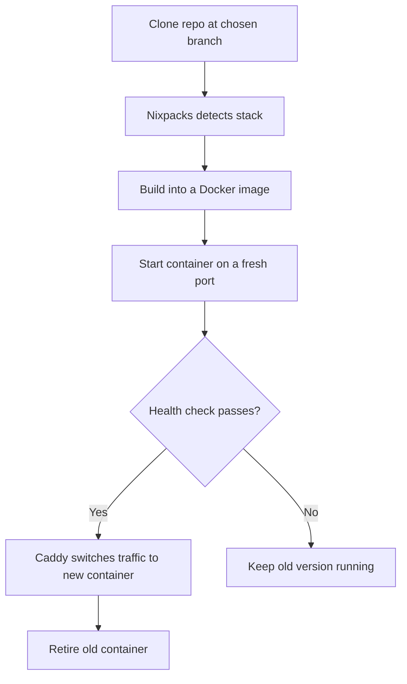

Deploying is the core of Better-PaaS: it takes your source code and turns it
into a running, internet-reachable app. This guide explains how that works and
how to make your apps deploy smoothly.

## How a deploy works

When you trigger a deploy, Better-PaaS runs this pipeline:



Each build is tagged with a unique deploy ID (`name:<deployID>`), which is what
makes [zero-downtime deploys and rollbacks](/docs/guides/rollbacks) possible.

## Auto-detection with Nixpacks

You usually **don't need a Dockerfile**. Nixpacks reads your project and figures
out how to build and run it based on the files it finds:

| If your repo has… | Nixpacks builds it as… |
| ----------------- | ---------------------- |
| `package.json` | A Node.js app |
| `requirements.txt` / `pyproject.toml` | A Python app |
| `go.mod` | A Go app |
| `Cargo.toml` | A Rust app |
| `Gemfile` | A Ruby app |
| …and many more | |

<Callout type="info" title="Tip: bind to the PORT variable">
  Better-PaaS tells your app which port to listen on through the `PORT`
  environment variable. Make sure your app reads it instead of hard-coding a
  port - almost every framework supports this out of the box.
</Callout>

## Build configuration

Auto-detection covers most apps, but you can override any part of it from the
deploy wizard or an app's **Configuration** tab:

| Setting | What it does |
| ------- | ------------ |
| **Root directory** | Build from a subdirectory instead of the repo root - useful for monorepos. Better-PaaS re-detects the framework for the directory you pick, and you can browse the repo's folders to choose one. |
| **Install / build / start commands** | Override the commands Nixpacks would run. Leave blank to use the detected defaults. |
| **Port override** | Tell Better-PaaS the exact port your app listens on, instead of relying on the injected `PORT`. |
| **Health check path** | An HTTP path (e.g. `/health`) probed before traffic cuts over to a new deploy. Leave empty for a plain TCP check. See [Rollbacks & zero-downtime](/docs/guides/rollbacks). |

### Building from a Dockerfile

When your repo contains a `Dockerfile`, Better-PaaS detects it and offers a
**build method** choice in the deploy wizard: **Nixpacks** or **Dockerfile**.
Pick Dockerfile to build the image exactly as your `Dockerfile` describes
instead of letting Nixpacks infer the build. You can point at a non-default
Dockerfile path if it isn't at the repo root.

<Callout type="info" title="No repo? Deploy an image or Dockerfile directly">
  You can also run a prebuilt registry image or a pasted Dockerfile with no Git
  repository at all - see the [App Catalog & Custom Images](/docs/guides/app-catalog)
  guide.
</Callout>

## Triggering a deploy

There are three ways to deploy:

1. **Manually** - click **Deploy a service** for a new app, or **Redeploy** on
   an existing one.
2. **On git push** - enable [auto-deploy](/docs/guides/auto-deploy) and every
   push to the configured branch redeploys automatically.
3. **Via the API** - call the deploy endpoint directly (see
   [API basics](#deploying-via-the-api)).

## Watching the build

While an app is **Building**, its logs stream live in the dashboard. This is the
first place to look if something goes wrong - Nixpacks and your build tooling
print exactly what they're doing.

The dashboard polls building apps automatically, so the status updates on its
own once the build finishes.

## Deploying via the API

Everything in the dashboard is backed by a simple HTTP API. To deploy
programmatically, send an authenticated request:

```bash
curl -X POST http://YOUR_SERVER:8080/api/deploy \
  -H "Authorization: Bearer $ADMIN_TOKEN" \
  -H "Content-Type: application/json" \
  -d '{
    "gitRepo": "https://github.com/you/my-app",
    "branch": "main"
  }'
```

Every API request must carry your admin token. See
[Security](/docs/security#the-admin-token) for details.

## Best practices

- **Keep builds reproducible.** Commit a lockfile (`package-lock.json`,
  `pnpm-lock.yaml`, `go.sum`, etc.) so builds are consistent.
- **Read the `PORT` env var** rather than hard-coding a port.
- **Use environment variables** for config and secrets - see
  [Environment Variables](/docs/guides/environment-variables).
- **Test the build locally** if a deploy fails; the same build commands run on
  the server.

## Next step

<Cards>
  <Card
    title="Auto-deploy on git push"
    href="/docs/guides/auto-deploy"
    description="Redeploy automatically on every push."
  />
  <Card
    title="Rollbacks"
    href="/docs/guides/rollbacks"
    description="Undo a bad deploy in one click."
  />
</Cards>
