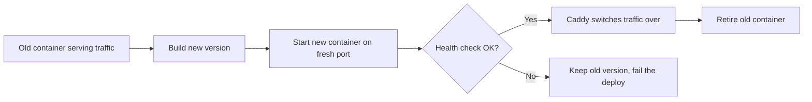

Shipping a broken version is one of the scariest parts of deploying. Better-PaaS
takes the fear out of it with zero-downtime deploys and one-click rollbacks.

## Zero-downtime deploys

When you deploy a new version, the old one keeps serving traffic the entire
time. Here's the sequence:

Because traffic only switches *after* the new container passes a health check,
your users never hit a dead app — even if the new build is broken.

## How builds are tagged

Every successful build is tagged with a unique deploy ID (`name:<deployID>`).
Better-PaaS keeps these around so you can return to any previous version
instantly.

## Rolling back

<Steps>
<Step>
Open your app and go to the **Deployments** tab.
</Step>
<Step>
Find a previous **successful** deploy in the history.
</Step>
<Step>
Click **Roll back**. Better-PaaS starts that prior build's container and switches
traffic to it — the same zero-downtime path as a normal deploy.
</Step>
</Steps>

<Callout type="info" title="Rollback is just another deploy">
  A rollback reuses an image you already built, so it's fast and safe. Nothing is
  rebuilt — Better-PaaS simply brings the older, known-good version back online.
</Callout>

## When should I roll back?

- A new release has a bug you didn't catch.
- Performance got noticeably worse after a deploy.
- You need to buy time to fix something properly.

Roll back first to restore service, then fix the issue and deploy forward again.

## Next step

<Cards>
  <Card
    title="Resource limits"
    href="/docs/guides/resource-limits"
    description="Cap CPU and memory per app."
  />
</Cards>
