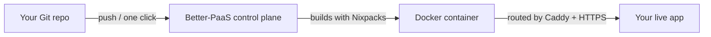

## The one-sentence version

**Better-PaaS takes your code from a Git repository and turns it into a live
website or API on your own server — automatically, with HTTPS, in one click.**

If you've ever used Heroku, Vercel, or Railway, this is the same idea, except
*you* run it on *your* machine. No monthly cloud bill, no vendor lock-in, no
limits except your server's size.

<Callout title="New to all this? You're in the right place.">
  This documentation assumes **no prior DevOps knowledge**. We explain the
  jargon as we go. If a term is unfamiliar, check the [Glossary](#glossary) at
  the bottom of this page.
</Callout>

## What problem does it solve?

Normally, putting an app online yourself means juggling a lot of moving parts:

- Renting a server and logging in over SSH
- Installing the right language runtime, dependencies, and build tools
- Wiring up a web server and a database
- Getting an SSL certificate so the site is `https://` and not `http://`
- Repeating all of it, carefully, every time you change your code

Better-PaaS does all of that **for you**. You connect a Git repo once, and from
then on every `git push` ships a new version of your app — built, started, and
served behind HTTPS without you touching the server.

## How it works (the 30-second tour)

1. **You** connect a Git repository through the dashboard.
2. **Nixpacks** inspects your code and figures out how to build it — no
   Dockerfile required for most apps.
3. The build runs inside a **Docker** container, isolated from everything else.
4. **Caddy** (a web server) routes web traffic to your container and
   automatically fetches an HTTPS certificate.
5. Your app is live. Push again and it redeploys with **zero downtime**.

You drive all of this from a clean **Next.js dashboard** — no command line needed
after the initial install.

## What's under the hood?

Better-PaaS is two programs working together:

| Part | What it is | What it does |
| ---- | ---------- | ------------ |
| **Control plane** | A small Go server | Talks to Docker, builds apps, manages domains, databases, backups, and the API. |
| **Dashboard** | A Next.js web app | The friendly UI you click around in to deploy and manage everything. |

It leans on battle-tested open-source tools — **Docker**, **Nixpacks**, and
**Caddy** — rather than reinventing them.

## Is it for me?

Better-PaaS is a great fit if you want to:

- Host side projects, hobby apps, or internal tools cheaply on a single VPS.
- Stop paying per-seat or per-app fees to a cloud platform.
- Keep full control of your data and infrastructure.

It's **not** trying to be a multi-region, auto-scaling cloud. It's designed to
make one server do a lot, simply.

## What can it do?

Beyond deploying from Git, Better-PaaS bundles the things a small server
actually needs:

- **One-click app catalog** plus custom Docker image and Dockerfile deploys —
  [App Catalog](/docs/guides/app-catalog).
- **Managed databases** (Postgres, Redis, MySQL) with a built-in
  [explorer](/docs/guides/database-explorer).
- **Custom domains** with automatic HTTPS, optionally via
  [Cloudflare DNS](/docs/guides/integrations#cloudflare).
- **Auto-deploy** on git push, [scheduled jobs](/docs/guides/scheduled-jobs),
  [backups](/docs/guides/backups), and [deploy notifications](/docs/guides/notifications).
- **Privacy-friendly web analytics** for your sites —
  [Web Analytics](/docs/guides/web-analytics).
- **Scoped agent tokens** for AI tools and automation — `paas connect`, then
  `paas setup` for Cursor/Claude MCP ([guide](/docs/guides/paas-cli)), or the
  [Agent Access API](/docs/guides/agent-access).
- **Live logs**, an in-container shell, and a
  [host server terminal](/docs/guides/server-terminal) — all in the browser.

## Where to go next

<Cards>
  <Card
    title="Quickstart"
    href="/docs/quickstart"
    description="Install and deploy your first app in under 10 minutes."
  />
  <Card
    title="Getting Started"
    href="/docs/getting-started/installation"
    description="A guided walkthrough of installation and your first deploy."
  />
  <Card
    title="Core Guides"
    href="/docs/guides/deploying-an-app"
    description="Learn each feature: domains, databases, cron, backups, and more."
  />
  <Card
    title="Security"
    href="/docs/security"
    description="Understand how Better-PaaS keeps your server safe."
  />
</Cards>

## Glossary

A quick reference for the terms used throughout these docs.

| Term | Plain-English meaning |
| ---- | --------------------- |
| **PaaS** | "Platform as a Service" — software that runs and manages your apps for you. |
| **VPS** | "Virtual Private Server" — a rented Linux machine in the cloud (e.g. from DigitalOcean, Hetzner, AWS). |
| **Container** | A lightweight, isolated box that holds one running app and everything it needs. Managed by Docker. |
| **Docker** | The tool that creates and runs containers. |
| **Nixpacks** | A tool that reads your code and automatically figures out how to build it. |
| **Caddy** | A web server that routes traffic to your apps and handles HTTPS certificates. |
| **Control plane** | The "brain" — the Better-PaaS server that orchestrates everything. |
| **Deploy** | The act of building and launching a new version of your app. |
| **HTTPS / SSL / TLS** | Encryption that makes a site `https://` and shows the padlock in the browser. |
| **Admin token** | The secret password that protects your Better-PaaS dashboard and API. |
