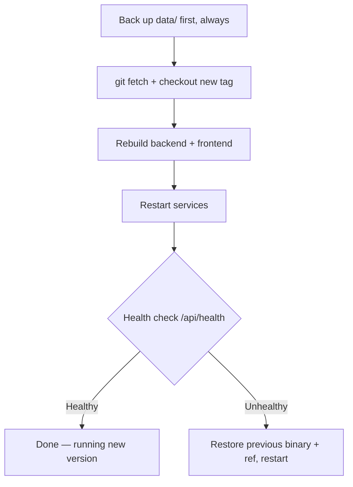

Better-PaaS can update itself to the latest release with one click — and if an
update goes wrong, it rolls itself back automatically.

## Updating from the dashboard

<Steps>
<Step>
Go to **Settings → Software Updates**.
</Step>
<Step>
Click **Check for updates**. Better-PaaS queries GitHub Releases for a newer
version (results are cached for 30 minutes).
</Step>
<Step>
If an update is available, click **Update now**.
</Step>
</Steps>

## What "Update now" does

The update is careful and self-healing. In order, it:



1. **Takes a backup** of your `data/` directory first — always.
2. Launches a detached helper that runs `git fetch` and checks out the new
   release tag.
3. Rebuilds the backend (swapping in the new binary only on a successful build,
   keeping `server.bak`) and rebuilds the frontend **out-of-band** into
   `.next.new` — the running dashboard keeps serving its current assets,
   untouched, for the entire build.
4. Atomically swaps the new frontend build in right before restarting, and
   carries the previous build's hashed CSS/JS files over so browser tabs that
   are still open don't lose their styles after the update.
5. Restarts the services and **health-checks** the new build at `/api/health`.
6. If the new build doesn't come up, it **automatically restores** the previous
   binary, frontend build, and git ref and restarts — so a bad release rolls
   itself back.

<Callout type="info" title="Your data is never touched">
  Updates never modify your `data/` directory. Schema changes are applied by
  additive migrations on the next boot, so upgrading is safe.
</Callout>

## Requirements

<Callout type="warn" title="Git-checkout installs only">
  One-click update is available only for git-checkout installs, because it
  currently rebuilds from source on the host. That means the server needs the
  Go / Node / pnpm toolchain present (the installer sets this up for you).
  Downloading prebuilt release binaries is a planned follow-up.
</Callout>

## How releases work

Releases are **tag-triggered**, not produced on every push. Pushing a tag
matching `v*` runs the release workflow:

```bash
git tag v1.2.3
git push origin v1.2.3   # this builds and publishes the release
```

A normal push to `main` does **not** create a release. Each release
cross-compiles the backend for Linux and macOS (amd64 + arm64), bakes the
version into the binary, and publishes the binaries plus a `SHA256SUMS` file to
GitHub Releases.

Keep tags semver-shaped (`vMAJOR.MINOR.PATCH`) — the updater parses
`major.minor.patch` for version comparison.

## Choosing the update source

The updater checks the repo named by `UPDATE_REPO`. It's resolved in this order:

1. The `UPDATE_REPO` environment variable
2. A stored value
3. The checkout's `git remote origin` URL

So git installs work even without the variable set. To pin it explicitly:

```ini title="/etc/systemd/system/better-paas-backend.service"
Environment=UPDATE_REPO=your-org/better-paas
```

## Next step

<Cards>
  <Card
    title="Troubleshooting"
    href="/docs/troubleshooting"
    description="Fixes for the most common issues."
  />
</Cards>
